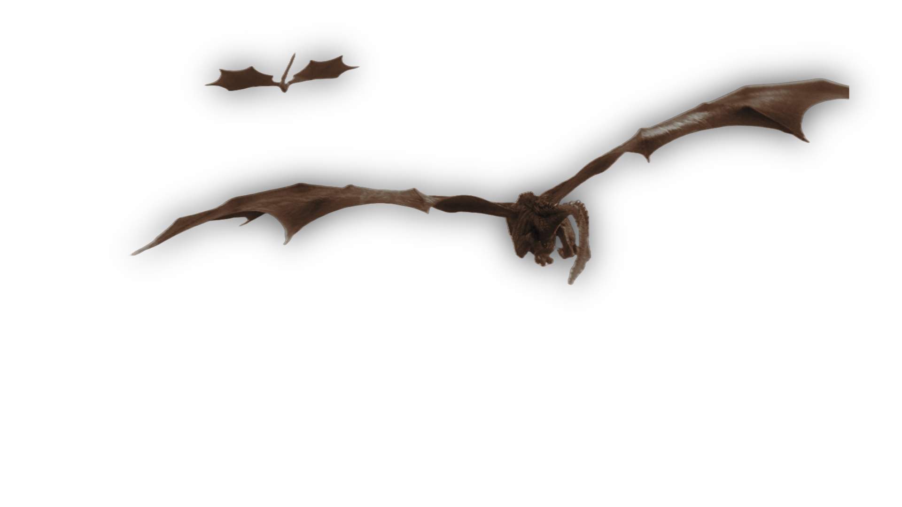

<!-- # Winter is coming. -->

<!-- 

  

 -->

<!--  -->

# Rudra Prasad Sahu
BS-MS 5th Year, Major in Physics and Minor in Computer Science

!!! quote
    **After three days without programming, life becomes meaningless**

## About

I'm a BS-MS student at IISER Berhampur with a passion for Deep Learning. I am highly interested in Deep Learning and AI.

## Research

### Automation of High-throughput Band Structure Calculation
Developed an automated high-throughput band structure calculation pipeline under [Dr. Bahadur Singh](https://sites.google.com/view/bahadur/home):

- Implemented code for VASP calculations from structure files
- Automated generation of density of states, band structures, and orbital-projected band structure plots
- Streamlined workflow for efficient electronic structure analysis and visualization

## Publications

### QuantumReservoirPy: A Software Package for Time Series Prediction
**Reviewer**

<!-- 

  

 -->

## Projects

### [Matrapin](https://matrapin.netlify.app/)
Password generation from shape of your language script, instead of keeping birthdays, phone number as passwords which are predictable. You just need to remember a word.

<!-- 

  

 -->
